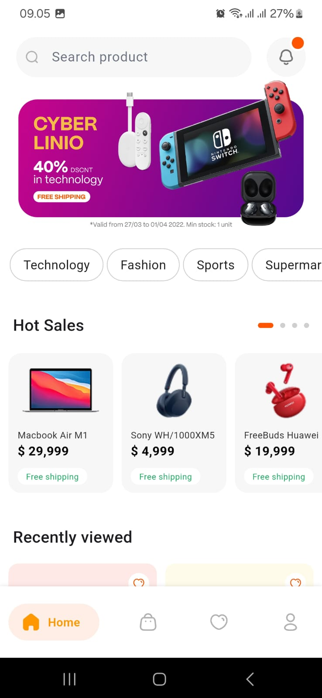
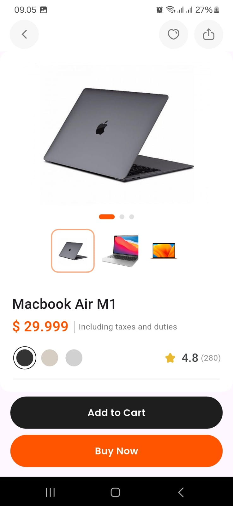
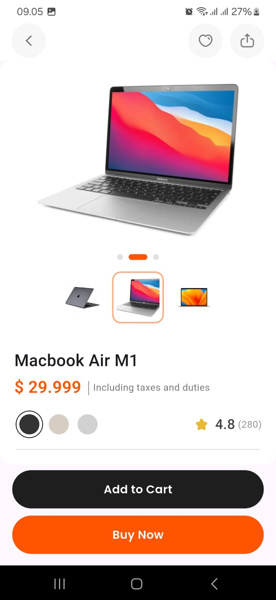
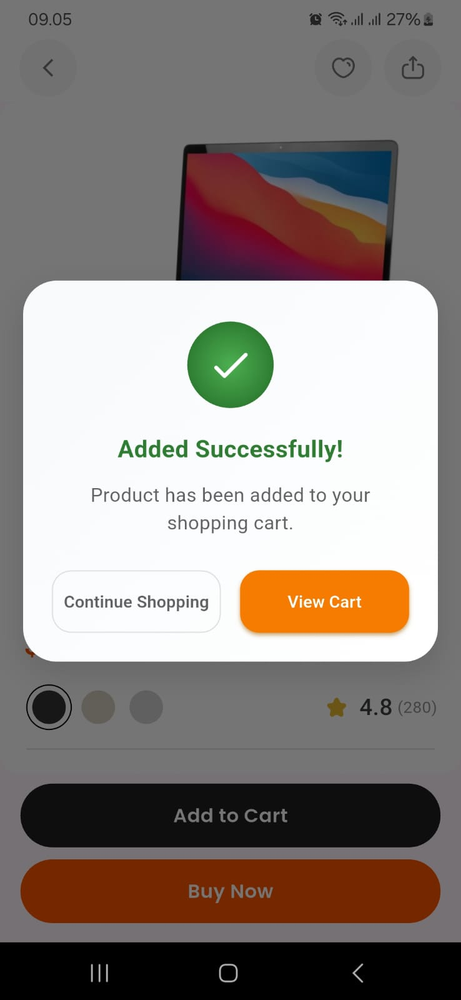
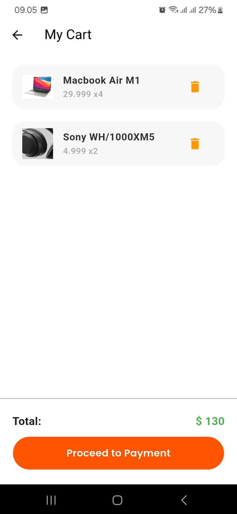
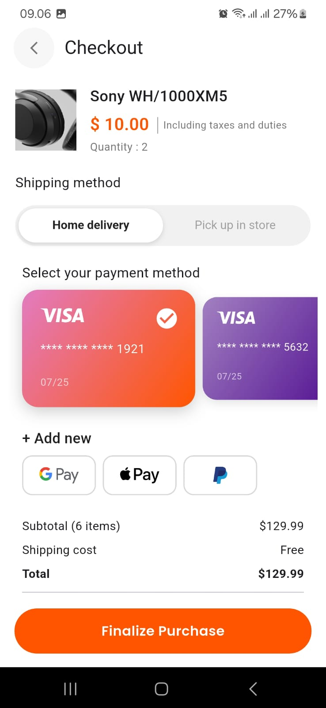
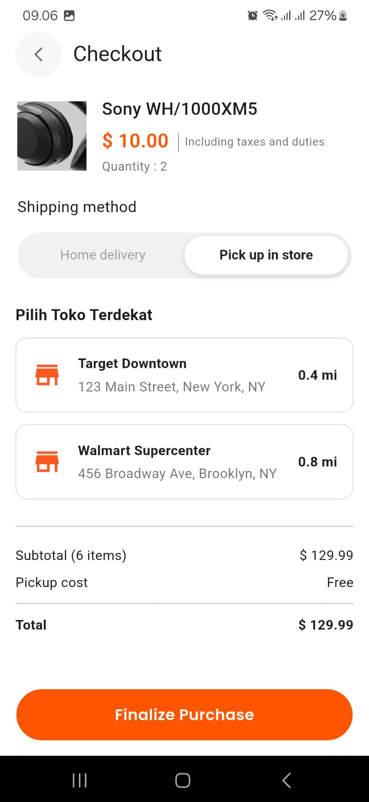

🛍️ Flutter Ecommerce UI Kit – Built with Provider (90% Figma Match)

This is a complete Flutter app template built from a Figma design, ideal for anyone building a shopping or catalog app. The UI is modular, clean, and uses Provider for state management.

✨ Overview
This Flutter project is a sliced implementation of a Figma design, with approximately 90% design accuracy. Ideal for developers looking for a ready-to-use UI kit with a clean and modular codebase that is easy to scale and customize.
👉 [Ecommerce App - Community (Figma Link)](https://www.figma.com/design/1SmL053uWOgP3pg6V5rHV8/Ecommerce-App--Community-?m=auto&t=DhlpU90Vo3wq79sK-1)

The app uses the Provider package for efficient state management and is structured per file to ensure maintainability and ease of updates.

🚀 Features
✅ 90% similarity to the original Figma design

✅ Built with Provider for state management

✅ Modular, scalable file structure

✅ Clean UI and customizable components

✅ All dummy data customizable via the models/ folder

✅ Designed for e-commerce, catalogs, and UI showcases

✅ Includes ProductCard, Cart, Checkout, and more

✅ Available for just $4

📂 Project Structure

lib/
├── main.dart
├── models/         # Dummy data and product structure
│   └── product_card.dart
├── providers/      # State management (Provider)
│   └── shop_provider.dart
├── pages/          # All pages (Home, Detail, Cart, etc.)
│   └── home_page.dart
│   └── detail_page.dart
├── components/     # Modular widgets (cards, buttons, etc.)
│   └── product_card_a.dart
│   └── custom_button.dart

📸 Preview

🔧 Customization
All product data can be updated directly from:

lib/models/
You can easily replace the text, prices, images, and other properties without restructuring the code.

Click the link below to purchase the full source code and start building your next e-commerce app today:
👉 [Buy Full Source Code via Payhip](https://payhip.com/b/3FIl4)

🛒 License & Pricing
License: Personal Use Only

Price: $6 USD

Payment Methods: (e.g. PayPal, Stripe.)

📩 Contact
Interested in purchasing or have any questions?
Feel free to reach out:

📧 Email: Irvans2731@gmail.com

💬 WhatsApp: +62 821 2304 8478

🌐 Portfolio: [My Portofolio](https://www.andriirvansyah.vercel.app)

Thanks for stopping by!
If you like this project, don’t forget to ⭐ the repo!
